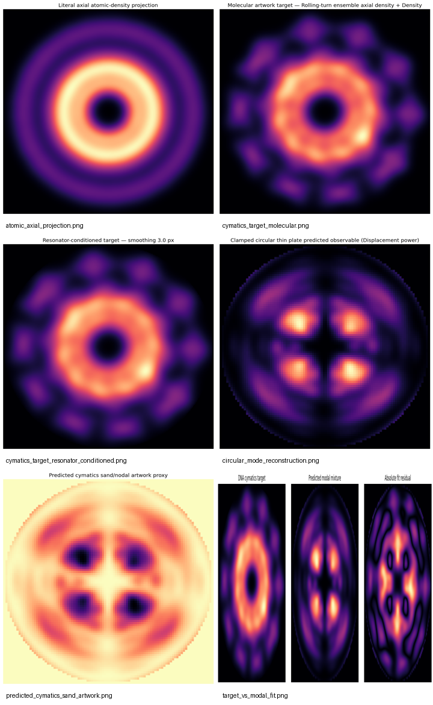

# DNA → 3D Geometry → 2D Molecular Artwork → Cymatics → Tones

DNA Cymatics is a research application for converting a DNA sequence into a **sequence-dependent 3-D structural model**, a **2-D molecular artwork target**, and a **set of resonator frequencies** that can be tested experimentally to create related cymatics artwork.

The project is intentionally split into two layers:

1. **Molecular geometry** — derive a reproducible spatial target from the DNA sequence.
2. **Wave / resonator physics** — determine which frequencies and mode combinations can reproduce the largest possible portion of that target on a selected resonator.

The app also produces a separate musical sonification for listening or downstream music generation.

## Canonical example

The bundled first test case is zebrafish **hoxb1a-201**, a 1,507-nt mature mRNA/cDNA sequence. The sequence is included in the application as a canonical reproducibility test.

The supplied example uses a rolling-turn molecular projection and a circular thin-plate resonator model.

### Example output

The image below is a **software-generated validation preview** for the canonical hoxb1a-201 workflow. It is not a photograph of a physical cymatics experiment. The panels are intended to show how molecular geometry is transformed into a resonator-compatible target and then into a predicted modal reconstruction.



Example files are in [`examples/hoxb1a/`](examples/hoxb1a/):

- [`preview.png`](examples/hoxb1a/preview.png) — generated workflow preview
- [`modes.csv`](examples/hoxb1a/modes.csv) — candidate/inverse-mode results
- [`physical_drive.wav`](examples/hoxb1a/physical_drive.wav) — exact-Hz modeled resonator drive
- [`musical_sonification.wav`](examples/hoxb1a/musical_sonification.wav) — separate musical output
- [`README.txt`](examples/hoxb1a/README.txt) — example settings and interpretation

## Process

The complete pipeline is:

```text
DNA sequence
    ↓
sequence validation + provenance
    ↓
3-D sequence-dependent geometry
    ↓
explicit heavy-atom model OR uploaded PDB/mmCIF
    ↓
3-D axis alignment
    ↓
atomic-coordinate projection
    ↓
2-D molecular density image
    ↓
whole-molecule / one-turn / phase-folded / rolling-turn projection
    ↓
spatial smoothing + resonator-scale conditioning
    ↓
2-D spatial spectrum + polar/angular harmonics
    ↓
ideal resonator mode library
    ↓
orientation matching + actuator-coupling proxy
    ↓
regularized non-negative inverse fit
    ↓
sparse top-N re-fit
    ↓
exact resonant frequencies + modal amplitudes
    ↓
physical-drive WAV
    ↓
optional real-plate calibration + camera verification
    ↓
separate musical sonification WAV
```

### 1. DNA sequence input

The application accepts:

- raw DNA sequence,
- genomic DNA,
- mature mRNA/cDNA,
- CDS, or
- a sequence retrieved from public resources.

The app keeps sequence provenance and source metadata with the analysis. A mature cDNA sequence is **not** the same thing as a genomic locus; when cDNA is modeled as a duplex, the application explicitly treats that as a modeling construct.

### 2. 3-D reconstruction

When an experimental **PDB/mmCIF** structure is available, the application can use its atomic coordinates directly.

When it is not, the default self-contained path uses the internal parametric model in `dna_atomic.py`. It creates explicit heavy-atom sites for both strands from nucleotide templates and a DNA-form-specific helical scaffold. Sequence-dependent local geometry changes the helical placement without allowing the global axis to drift arbitrarily.

This internal model is deterministic and reproducible, but it is **not** a force-field-minimized or experimentally solved structure.

### 3. Atomic 2-D projection

The structural coordinates are aligned to the helical axis and projected into the transverse plane. Each atom contributes a small spatial footprint to the image.

Available weighting concepts include:

- uniform atom/site count,
- atomic mass,
- electron-count proxy (atomic number), and
- van-der-Waals volume proxy.

These are modeling choices, not exact scattering-density calculations.

### 4. Why the projection is not just a line

A literal side projection of a gene-length DNA molecule is physically elongated because the molecule is hundreds of nanometers long while its diameter is only a few nanometers. That is why a straightforward side projection looks like a line.

For compact molecular artwork, the app provides several axial representations:

**Whole-molecule axial density**

Shows the complete molecule without folding. This is best for structural inspection.

**Single-turn axial density**

Shows one local helical-turn window. This is useful for studying a specific sequence region.

**Helical phase-folded density**

Rotates successive helical regions into a common phase frame.

**Rolling-turn ensemble axial density**

Uses every overlapping approximately one-turn window and phase-aligns the windows before accumulating them. This is the default artwork target because the **entire DNA sequence contributes** rather than an arbitrary single window.

Conceptually:

```text
whole DNA sequence
     ↓
sliding ~one-turn windows
     ↓
phase-align each window
     ↓
project atoms into x-y
     ↓
accumulate all windows
     ↓
sequence-wide molecular signature
```

The rolling-turn image is therefore a **sequence-derived molecular signature**, not a claim that the physical gene is literally folded into one turn.

### 5. Convert molecular detail into a resonator-compatible target

A millimeter-scale plate cannot reproduce angstrom-scale atomic detail. The molecular image is therefore normalized, smoothed, and confined to the selected resonator aperture.

This is a spatial-scale filtering step:

```text
atomic target
    ↓
remove features below resonator scale
    ↓
retain larger radial/angular structure
    ↓
resonator target
```

The application keeps the unfiltered molecular image so the two representations remain distinguishable.

### 6. Extract spatial information

The conditioned target is analyzed in two complementary ways:

**2-D Fourier spectrum**

Identifies dominant spatial frequencies in the artwork.

**Polar/angular harmonics**

For a circular resonator the target is also represented as radial/angular content, including angular orders such as `m = 0, 1, 2, ...`.

The angular structure is especially important for flower- and snowflake-like patterns.

### 7. Solve the inverse cymatics problem

The app constructs an idealized resonator mode library. The preferred built-in model is a **clamped circular thin plate**.

A mode is represented conceptually as:

```text
phi(r,theta) = radial_mode(r) * angular_mode(theta)
```

with the radial solution expressed using the thin-plate Bessel/modified-Bessel basis for the selected boundary condition.

For each candidate mode the app searches orientation, estimates actuator coupling, and scores spatial similarity to the target.

It then solves a non-negative regularized inverse problem:

```text
find modal weights x >= 0
that minimize

||A x - b||² + λ ||x||²
```

where `A` is the selected resonator-mode basis and `b` is the DNA-derived target field.

The strongest modes are retained and the reduced basis is **re-fit** so the final reported mixture matches the final audio output.

### 8. Generate the exact physical-drive tones

The primary physical output is generated using the calculated resonant frequencies directly.

There is **no musical pitch quantization** in the physical-drive WAV.

The audio contains the frequencies and amplitudes required by the selected model. This is the file intended for testing on a real resonator.

### 9. Generate musical tones separately

The musical output is a different product.

The physical frequencies can be mapped into a practical musical register and optionally quantized to notes. Harmonics, duration, rhythm, and envelope can then be added for creative use or for feeding systems such as Suno.

Therefore:

```text
physical frequency ≠ musical note
```

unless an experiment deliberately chooses to quantize the drive.

### 10. Verify the physical experiment

A physical validation loop is:

```text
DNA sequence
    ↓
DNA-derived 2-D target
    ↓
predicted resonant mode set
    ↓
exact-Hz drive WAV
    ↓
real plate / membrane
    ↓
sand, powder, liquid, or another visible medium
    ↓
camera image
    ↓
registration
    ↓
image comparison
```

The application can compare a measured pattern with the generated target using metrics including:

- RMSE,
- Pearson spatial correlation,
- Dice overlap,
- Intersection-over-Union,
- boundary/edge distance, and
- angular-harmonic correlation.

This is the correct way to determine whether a particular frequency set actually produces the desired geometry.

The software-generated predicted pattern is **not** considered experimental validation. The physical experiment and measured image are the verification step.

## Physical calibration

Ideal analytical resonators are only approximations to a real apparatus. A real plate is affected by its dimensions, material, thickness, mounting, boundary condition, actuator position, damping, and mechanical response.

The application therefore supports a calibration CSV:

```csv
frequency_Hz,response
110.7,0.20
267.1,0.91
453.2,0.54
```

A resonance sweep should be performed on the actual apparatus first. Measured resonant frequencies and response can then be supplied to the application so theoretical candidates are mapped toward the real resonator.

The current calibration layer is intentionally conservative: it does **not** claim to reconstruct a complete complex transfer function or guarantee the measured mode shape is identical to the ideal analytical mode.

## Structure types and scientific scope

The application supports:

```text
1. Genomic DNA
   Includes introns and genomic/intergenic sequence.

2. Mature mRNA/cDNA
   Includes transcript sequence and UTRs when available.

3. Protein-coding region / CDS
   Translated region only.
```

A cDNA transcript and a genomic DNA locus must not be conflated. The structural model used for each input is therefore recorded in the analysis metadata.

## Supported DNA-form presets

The internal geometry model supports idealized structural presets including B-DNA, A-DNA, A-RNA, and a left-handed reference for Z-DNA-like geometry. C-DNA is treated as an approximation unless experimental coordinates are supplied.

For a scientifically specific structural claim, experimental coordinates should take precedence over the internal parametric model.

## Installation

```bash
python -m venv .venv
```

Windows:

```bat
.venv\\Scripts\\activate
```

Linux/macOS:

```bash
source .venv/bin/activate
```

Install dependencies:

```bash
pip install -r requirements.txt
```

Run:

```bash
python app.py
```

No AmberTools, NAB, 3DNA, or other external molecular-builder runtime is required.

## Recommended hoxb1a-201 starting configuration

```text
Sequence:               hoxb1a-201
Projection:             Rolling-turn ensemble axial density
Structure source:       Internal parametric heavy-atom model
Atomic weighting:       Electron-count proxy
Atom footprint:         Element VDW Gaussian
Resonator:              Clamped circular thin plate
Radius:                 Actual physical plate radius
Thickness/material:     Match actual plate
Observable:             Displacement power
Candidate modes:        24–48
Top modes:              6–10
```

These values are starting points for an experiment, not universal constants.

## Files

- `app.py` — Gradio interface and end-to-end orchestration
- `dna_atomic.py` — internal sequence-to-3D heavy-atom geometry and atomic projection
- `dna_cymatics.py` — spatial analysis, resonator models, inverse fitting, verification metrics, and audio synthesis
- `dna_sources.py` — ZFIN/NCBI/Ensembl retrieval and canonical sequence support
- `tests.py` — automated tests
- `BUILD_ALGORITHM.md` — implementation details
- `SCIENTIFIC_METHODS.md` — scientific rationale, equations, and scope
- `MODEL_LIMITATIONS.txt` — uncertainty and limitations
- `EXPERIMENTAL_PROTOCOL.txt` — physical cymatics validation procedure
- `REFERENCES.md` — reference list and source notes
- `examples/hoxb1a/` — canonical example outputs and preview image

## Interpretation and limitations

This project should be interpreted as an **inverse-design and sonification framework**, not as evidence that DNA has a unique intrinsic audible frequency.

The strongest claim the current software can support is:

> Given a defined DNA sequence, a defined structural model, a defined 2-D projection, and a defined resonator model, the application can calculate a reproducible set of candidate resonant frequencies whose modeled spatial field most closely approximates the selected DNA-derived target within that model.

A real cymatics experiment is required to determine how closely the predicted pattern matches the physical system.
